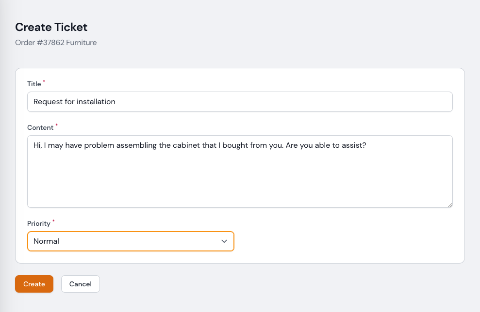
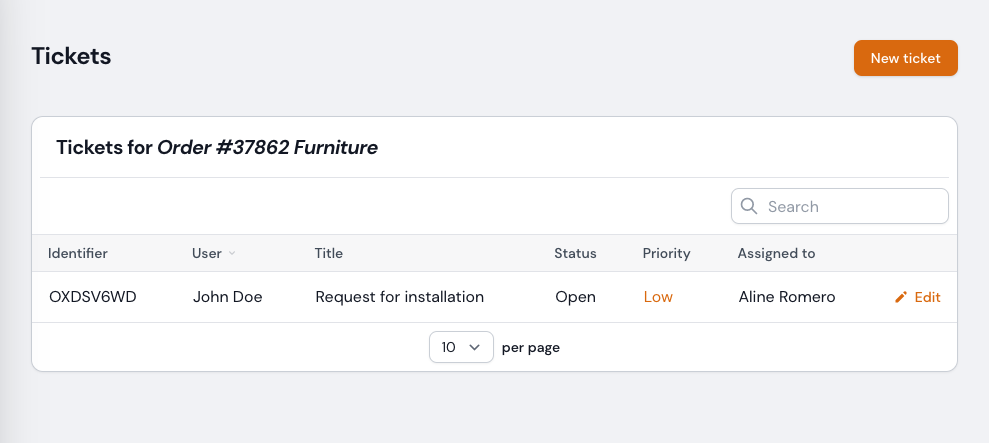

# Filament Ticketing

[](https://packagist.org/packages/sgcomptech/filament-ticketing)
[](https://github.com/sgcomptech/filament-ticketing/actions?query=workflow%3Arun-tests+branch%3Amain)
[](https://github.com/sgcomptech/filament-ticketing/actions?query=workflow%3A"Fix+PHP+code+style+issues"+branch%3Amain)
[](https://packagist.org/packages/sgcomptech/filament-ticketing)
[](https://www.codefactor.io/repository/github/sgcomptech/filament-ticketing)

A Laravel Filament Admin Panel plugin package to add support for issue tracking and ticketing system into your Filament project.






## Requirements

| Software | Versions |
| -------- | -------- |
| PHP | 8.0, 8.1 |
| Laravel | 8.x, 9.x |
| Filament | 2.x |

## Installation

You can install the package via composer:

```bash
composer require sgcomptech/filament-ticketing
```

Run the migrations with:

```bash
php artisan migrate
```

You can publish the config file with:

```bash
php artisan vendor:publish --tag="filament-ticketing-config"
```

This is the content of the published config file:

```php
return [
  // Defines your user model. At the moment, requires 'name' and 'email' attributes.
  'user-model' => \App\Models\User::class,

  // You can extend the package's TicketResource to customize to your needs.
  'ticket-resource' => Sgcomptech\FilamentTicketing\Filament\Resources\TicketResource::class,

  // whether a ticket must be strictly interacted with another model
  'is_strictly_interacted' => false,

  // filament navigation
  'navigation' => [
	  'group' => 'Tickets',
	  'sort' => 1,
  ],

  // ticket statuses
  'statuses' => [
	  1 => 'Open',
	  2 => 'Pending',
	  3 => 'Resolved',
	  4 => 'Closed',
  ],

  // ticket priorities
  'priorities' => [
	  1 => 'Low',
	  2 => 'Normal',
	  3 => 'High',
	  4 => 'Critical',
  ],

  // use authorization
  'use_authorization' => false,

  // event broadcast channel
  'event_broadcast_channel' => 'ticket-channel',
];
```

## Usage

### Interact your models with tickets

Tickets could be on general matters or could be related to some instances in your project.
For example, your users may raise a ticket that is related to one of their past orders.
In such case, you may want to interact that order with the tickets raised.
You can achieve this by implementing `HasTickets` and use `InteractsWithTickets` trait in your eloquent model class.
By default, this package uses the model attribute `name` for display.
You can change this by implementing `public function model_name(): string` to return the required attribute for display.

```php
use Illuminate\Database\Eloquent\Model;
use Sgcomptech\FilamentTicketing\Interfaces\HasTickets;
use Sgcomptech\FilamentTicketing\Traits\InteractsWithTickets;

class Item extends Model implements HasTickets
{
  use InteractsWithTickets;
}
```

Once your model is prepared, you can add a table action button at the model resource to navigate to the linked ticket list page.
At this list page, the associated tickets for that model instance will be displayed and any new tickets created will also be linked to that model instance.

```php
use Sgcomptech\FilamentTicketing\Tables\Actions\TicketAction;

public static function table(Table $table): Table
{
  return $table
		->columns([
			TextColumn::make('name'),
		])
		->actions([
			EditAction::make(),
			TicketAction::make('ticket'),
		]);
}
```


It is possible to implement `HasTickets` on multiple models in your project.

### Filament Admin Panel Menu

As with most other Filament resources, you can control and secure the access of Ticket operations in Admin Panel's menu with a policy file. For example, you can create a new policy file and register it in your AuthServiceProvider.

```php
protected $policies = [
  'Sgcomptech\FilamentTicketing\Models\Ticket' => 'App\Policies\TicketPolicy',
];
```

For more details, see [Laravel model policies](https://laravel.com/docs/9.x/authorization#creating-policies).

### Authorization

This package has an option to use Laravel policies to authorise various actions that can be performed on the tickets.

Besides the usual Filament resource policies, the additional permissions to implement are:

1. `manageAllTickets` - grant permission to user who can add comments and change status of any tickets.
2. `manageAssignedTickets` - grant permission to user who can only add comments and change status to tickets that are explicitly assigned to them.
3. `assignTickets` - grant permission to user who can assign tickets to any users who have the permission `manageAssignedTickets`.

For example, you may use other authorization packages, like [Filament User Authentication](https://github.com/phpsa/filament-authentication), to implement `TicketPolicies` in your policy file like so:

```php
use App\Models\User;
use Illuminate\Auth\Access\HandlesAuthorization;
use Sgcomptech\FilamentTicketing\Interfaces\TicketPolicies;
use Sgcomptech\FilamentTicketing\Models\Ticket;

class TicketPolicy implements TicketPolicies
{
  use HandlesAuthorization;

  public function viewAny(User $user)
  {
    return true;
  }

  public function view(User $user, Ticket $ticket)
  {
    return true;
  }

  public function create(User $user)
  {
    return true;
  }

  public function update(User $user, Ticket $ticket)
  {
    return $user->can('manage all tickets')
      || $user->can('assign tickets')
      || ($user->can('manage assigned tickets') && $ticket->assigned_to_id == $user->id)
      || $ticket->user_id == $user->id;
  }

  public function delete(User $user, Ticket $ticket)
  {
    return $user->can('Delete Tickets');
  }

  public function manageAllTickets($user): bool
  {
    return $user->can('Manage All Tickets');
  }

  public function manageAssignedTickets($user): bool
  {
    return $user->can('Manage Assigned Tickets');
  }

  public function assignTickets($user): bool
  {
    return $user->can('Assign Tickets');
  }
}
```

### Events

This package will dispatch the following events as listed in the table below. Note that the namespace of these events is `Sgcomptech\FilamentTicketing\Events`.

| Event | Event Object | Description |
| ----------- | ----------- | ----------- |
| `NewTicket` | `Ticket` | When a new ticket is created. |
| `NewComment` | `Comment` | When a new comment is created. |
| `NewResponse` | `Comment` | When a new response is created. |
| `NewAssignment` | `Ticket` | When a ticket is being assigned to a user. |

You can use these events to send notifications to relevant users in your application. Refer to Laravel document on how to [register Events and Listeners](https://laravel.com/docs/9.x/events#generating-events-and-listeners).

## Testing

```bash
composer test
```

## Todo

- [ ] Translation
- [x] List tickets filters
- [ ] Badges
- [ ] Widget
- [ ] Attach media or files to ticket

## Changelog

Please see [CHANGELOG](CHANGELOG.md) for more information on what has changed recently.

## Contributing

If you want to contribute to Filament Ticketing packages, you may fork this repository, create a new branch, make you changes and submit a PR.
Be sure to run the test scripts to make sure that nothing else is broken.
More details can be found at [github quickstart](https://docs.github.com/en/get-started/quickstart/contributing-to-projects).

## Security Vulnerabilities

If you discover any security related issues, please email sgcomptechpteltd@gmail.com instead of using the issue tracker.

## Credits

- [Lee Kai Mun](https://github.com/leekaimun)
- [All Contributors](../../contributors)

## License

The MIT License (MIT). Please see [License File](LICENSE.md) for more information.
